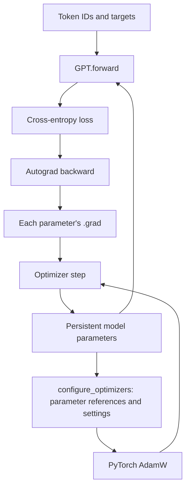

# MiniP

MiniP is a small learning and experimentation repository derived from NanoGPT. Its focus is making **GPT's forward computation, parameter initialization, automatic differentiation, and AdamW updates** easy to trace in a few Python files.

**This checkout: `completep`.** This is the CompleteP experiment version; neutral defaults are available, with the initialization-order distinction documented below.

## Three branches

| Branch | Purpose | What to compare |
| --- | --- | --- |
| `nanogpt-upstream` | Unmodified NanoGPT snapshot at `3adf61e154c3fe3fca428ad6bc3818b27a3b8291` | The original implementation and README |
| `main` | Simplified NanoGPT baseline with persistent parameter tensors and an explicit functional forward | How the original model and training loop were made easier to read |
| `completep` | Numerical parameterization settings for the author's NanoGPT-based CompleteP implementation | Initialization, forward scaling, and optimizer-group differences |

`main` and `completep` share a simplified code lineage and are maintained as parallel versions. `completep` is not necessarily a descendant of the latest `main` commit. The upstream branch stays fixed as a reference.

```bash
git switch main
git diff nanogpt-upstream main -- model.py train.py sample.py
git diff main completep -- model.py train.py
```

## Read the algorithm through the code

Start with **`GPT.forward()`**, then follow the loss into the training loop and optimizer update.

| Step | Where to read | What happens |
| --- | --- | --- |
| Create parameters | [GPT.__init__](model.py#L62) | Register persistent weight/bias tensors in `nn.ParameterDict`; tie the token embedding and output head |
| Initialize values | [initialize_parameters](model.py#L100) | Set matrix standard deviations, LayerNorm gamma/beta, and linear biases |
| Forward | [GPT.forward](model.py#L158) | Token/position embeddings, repeated attention and MLP residual updates, final LayerNorm, logits and loss |
| Configure updates | [configure_optimizers](model.py#L227) | List parameter tensors and roles, assign group settings, return a PyTorch AdamW object |
| Backward and update | [train.main](train.py#L97) | Accumulate loss gradients, optionally clip them, run AdamW, and clear gradients |
| Generate text | [sample.py](sample.py) and [GPT.generate](model.py#L322) | Load a saved checkpoint and generate tokens autoregressively |

### Forward: one visible chain

For token IDs `x` of shape `[B, T]`, the hidden state has shape `[B, T, N]`. The model uses learned absolute position embeddings, Pre-LayerNorm, GELU, and a shared input/output embedding weight.

```text
token IDs
  -> token embedding + learned position embedding -> dropout
  -> repeat for each layer:
       LayerNorm -> QKV projection -> causal attention -> output projection
       -> dropout -> residual addition
       LayerNorm -> MLP expansion -> GELU -> MLP output projection
       -> dropout -> residual addition
  -> final LayerNorm -> vocabulary projection
  -> logits [B, T, V] and next-token cross-entropy loss
```

Without targets, forward returns logits only for the last position, `[B, 1, V]`, and `None` for the loss. This supports the sampling loop.

`model.py` stores parameters separately from their computation. `GPT.forward()` calls `torch.nn.functional` operations directly; it does not construct new trainable layers on each call. Temporary `nn.Linear`/`nn.Embedding` constructors are used during model construction to create tensors, not to hide the forward chain.

### Backward and AdamW: the same tensors throughout



The diagram separates optimizer construction, done once, from updates, performed repeatedly. Conceptually a training iteration is:

```python
logits, loss = model(x, targets)
loss.backward()
optimizer.step()
optimizer.zero_grad(set_to_none=True)
```

The actual trainer also divides the loss across gradient-accumulation microbatches, optionally clips gradients, and uses `GradScaler` calls around backward/step. With the documented CPU/MPS `float32` runs, gradient scaling is disabled.

There is no handwritten backward method or custom AdamW implementation. PyTorch autograd writes gradients into each parameter's `.grad`. AdamW holds **references to those same parameters**, tracks their moment estimates, and updates them in place when a step occurs. The next forward reads the updated values.

### Parameter roles and optimizer groups

The optimizer function lists each parameter once, alongside its role. It does not infer roles using name prefixes or suffixes. Optional biases that are `None` and parameters with `requires_grad=False` are omitted; the shared head is counted once.

| Parameter role | `main`: NanoGPT grouping | `completep`: when role settings are supplied |
| --- | --- | --- |
| Token/position embedding, including the shared head | Weight decay | Embedding group |
| Hidden QKV, attention output, MLP input/output matrices | Weight decay | Hidden-weight group |
| Hidden LayerNorm gamma/beta | No weight decay | Hidden-norm group |
| Hidden linear biases | No weight decay | Hidden-bias group |
| Final LayerNorm gamma/beta | No weight decay | Final-norm group |

**CompleteP does not add a new set of trainable parameters through optimizer grouping.** It assigns different update settings to the existing parameters.

`lr`, `betas`, and `eps` passed to the AdamW constructor are defaults. A parameter group can override them. In the CompleteP branch, `lr_scale` is an additional field interpreted by **the training loop**, not automatically by AdamW:

```python
group['lr'] = scheduled_lr * group.get('lr_scale', 1.0)
```

Without CompleteP group settings, the experiment branch also uses the NanoGPT two-group scheme. The baseline branch has no `group_settings` argument.

## What was simplified from NanoGPT

| Area | Changes in the simplified branches |
| --- | --- |
| Model readability | Replaced nested custom Block/Attention/MLP computation with an explicit functional forward over registered parameter tensors |
| Initialization | Exposed matrix standard deviations and norm/bias initial values through `GPTConfig`; put initialization in a dedicated method |
| Optimizer readability | Made the parameter roster and update-group assignment explicit |
| Training entry point | Kept settings in `get_config()` and a single-device scratch-training workflow in `main()` |
| Removed training paths | No resume training, pretrained GPT-2 initialization, DDP/multi-process training, `torch.compile` toggle, or W&B logging in `train.py` |
| Removed model utilities | No pretrained-weight loader, context-cropping method, or model MFU estimator |
| Removed analysis notebooks | Removed upstream `scaling_laws.ipynb` and `transformer_sizing.ipynb` from the working branches |

Data preparation, gradient accumulation, optional gradient clipping, validation loss, warmup/cosine scheduling, checkpoint saving, and sampling remain. **No resume training does not mean no checkpoint loading:** `sample.py` still loads saved weights for generation, including supported earlier checkpoint layouts.

`bench.py`, `configurator.py`, some upstream presets, dataset helpers, and assets remain. The old pretrained/finetuning presets are not supported entry points for this scratch trainer. Use the explicit commands below rather than assuming every inherited preset is compatible. `bench.py` is an auxiliary benchmark, not part of the train-to-checkpoint-to-sample path.

## CompleteP-specific additions

The `completep` branch adds caller-supplied values for:

- QKV and MLP expansion initialization standard deviations, alongside configurable output-projection standard deviations.
- Attention score scaling (`1/D` for the author's muP setup, versus NanoGPT's default `1/sqrt(D)`), where `D` is the head width.
- Input, attention-residual, MLP-residual, and training-output multipliers.
- Per-role learning-rate scales, Adam epsilon, and weight decay.

Width/depth formulas are computed by the caller or experiment Notebook and passed as numbers. The model does not derive the full paper parameterization automatically from width and depth. Relevant additions are enclosed by `### Begin CompleteP code ###` and `### End CompleteP code ###` comments.

The author's implementation applies output scaling when targets are supplied, including loss evaluation, but omits it on the no-target sampling path. MiniP's experiment branch follows that behavior.

There is also an initialization-order difference between the working branches: `main` retains the baseline's repeated initialization order, whereas `completep` initializes each shared tensor once in a layer-local pass. Even with neutral forward scales, their independent same-seed initial weights need not match. This is distinct from matching computations and updates **after loading the same weights**.

## Devices and execution scope

The documented small runs have been exercised on CPU and Apple Silicon MPS using `float32`. Development was on an M4 Max with Python 3.13.7 and PyTorch 2.14.0.

CUDA code remains, including autocast, optional gradient scaling and CUDA-only fused AdamW selection. CUDA was not validated in the current local checks. The trainer's inherited default is still `device='cuda'`, so **explicitly select `mps` or `cpu` and `float32` on a Mac**. Multi-GPU/DDP training has been removed.

## Quick start: a small scratch run

These commands apply to `main` and to the neutral/default settings on `completep`. They are a pipeline check, not a CompleteP paper reproduction.

In a fresh checkout, create an environment and install the direct dependencies for this example:

```bash
uv venv --python 3.13 .venv
uv pip install --python .venv/bin/python torch==2.14.0 numpy==2.5.3 requests==2.34.2 tiktoken==0.14.0
.venv/bin/python data/shakespeare_char/prepare.py
```

Train on MPS:

```bash
.venv/bin/python train.py \
    --dataset=shakespeare_char \
    --out_dir=out-readme-smoke \
    --device=mps \
    --dtype=float32 \
    --n_layer=2 \
    --n_head=2 \
    --n_embd=128 \
    --block_size=128 \
    --batch_size=8 \
    --gradient_accumulation_steps=1 \
    --dropout=0.0 \
    --learning_rate=0.001 \
    --decay_lr=False \
    --max_iters=100 \
    --eval_interval=50 \
    --eval_iters=10 \
    --log_interval=10
```

Generate from the checkpoint:

```bash
.venv/bin/python sample.py \
    --out_dir=out-readme-smoke \
    --device=mps \
    --dtype=float32 \
    --num_samples=1 \
    --max_new_tokens=200 \
    --temperature=0.8 \
    --top_k=40
```

For CPU, replace `--device=mps` with `--device=cpu` in both commands. Do not pass removed options such as `--init_from`, `--compile`, or `--wandb_log`.

The model is about 0.40M parameters. Expect finite losses, a checkpoint, and generated character text; coherent language is not the goal of this short run. The loop retains NanoGPT's step convention: `max_iters=100` performs updates numbered 0 through 100, with evaluation/checkpoint saving before the corresponding update. The final saved checkpoint is therefore from before update 100.

## Verification and local artifacts

Verification results have different scopes:

| Check | What it establishes | Limit |
| --- | --- | --- |
| Baseline versus pinned NanoGPT | Initialization, forward, gradients and updates in the recorded settings | Earlier MPS tests with nonzero dropout also showed upstream self-repeatability differences; not a blanket bitwise guarantee |
| CompleteP shared-weight alignment | Matching computations and updates against the pinned author implementation | Does not establish identical independent same-seed initialization after the layer-local initialization change |
| Optimizer roster refactor | 20 experiment-branch and 6 baseline-branch CPU/MPS cases passed, including group order, frozen parameters, three update steps and optimizer-state loading | Checks each branch before/after the optimizer change; not a full training reproduction |
| Reduced depth experiment | A small Figure 7-style observation was run previously | Did not reproduce every paper phenomenon; no claim of full Figure 7 reproduction |

Notebooks, their outputs, local Chinese study notes, checkpoints, and generated datasets are not distributed with the working branches. In the author's local checkout, the latest optimizer check is `notebooks/04-optimizer-grouping-check.ipynb`; other runs record their own source versions. These paths are local references, not files expected in a fresh clone.

The `notebooks/`, `docs/`, and `results/` directories are Git-ignored. Local study artifacts were removed from the published working-branch history; the untouched upstream reference still contains its original public files. Historical experiment tags remain local unless explicitly shared.

## Sources and license

- [Karpathy's NanoGPT](https://github.com/karpathy/nanoGPT), pinned at `3adf61e154c3fe3fca428ad6bc3818b27a3b8291` for the upstream branch.
- [The author's NanoGPT-based muP/CompleteP implementation](https://github.com/EleutherAI/nanoGPT-mup), inspected at `88458c3f063b5c3c573f87435dc91f680174f0da`.
- [CompleteP paper](https://arxiv.org/abs/2505.01618).

The code retains the upstream [MIT license](LICENSE). The upstream branch's original README documents the original project, not the reduced workflow on the two working branches.
